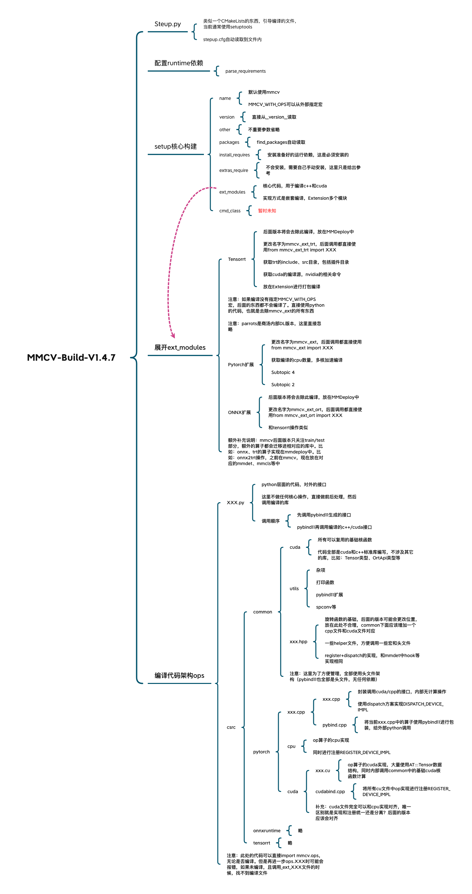
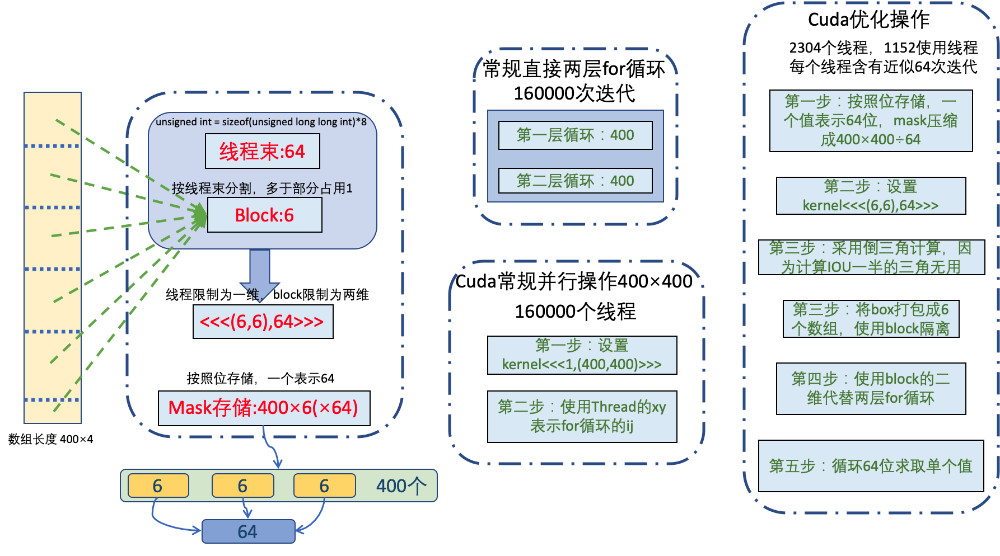

# Introduction
This project inherit from [MMCV](https://github.com/open-mmlab/mmcv/tree/master) for practice cuda and cpp extension in torch.

# Installation
``` shell
pip install -e .
```

# 详细解剖
More details for MMCV build as follow image:



## 1.1 Register+Dispatch

- 简化版的代码可以参考c++里面`main执行之前进行操作`章节

``` c++
// 定义一个DeviceRegistry模板类，输入两个参数
// 第一个参数是函数指针，第二个参数是函数（无用）
template <typename F, F f>
class DeviceRegistry;

// 模板类外面套了一层模板，用于可变参数的输入和函数的输入
// 注意：可变参数在中间，后面的参数一定是可推导的类型
template <typename Ret, typename... Args, Ret (*f)(Args...)>
// DeviceRegistry模板类具体化
class DeviceRegistry<Ret (*)(Args...), f> {
 public:
  using FunctionType = Ret (*)(Args...); // 重命名类型
  static const int MAX_DEVICE_TYPES =
      int8_t(at::DeviceType::COMPILE_TIME_MAX_DEVICE_TYPES);
	// 将函数地址注册进函数指针中
  void Register(at::DeviceType device, FunctionType function) {
    funcs_[int8_t(device)] = function;
  }
	// 根据type类型查找函数
  FunctionType Find(at::DeviceType device) const {
    return funcs_[int8_t(device)];
  }
	// 注意这里是static数据，返回引用变成全局变量
  static DeviceRegistry& instance() {
    static DeviceRegistry inst;
    return inst;
  }

 private:
  DeviceRegistry() {
    for (size_t i = 0; i < MAX_DEVICE_TYPES; ++i) {
      funcs_[i] = nullptr;
    }
  };
  FunctionType funcs_[MAX_DEVICE_TYPES];
};

```

``` c++
// 获得实例化的类（注意不同的template，实例的对象也是不同的）
define DEVICE_REGISTRY(key) DeviceRegistry<decltype(&(key)), key>::instance()
// 此处是难点
// 1. struct的名字不能重复，因为#define会在编译阶段检查，CPU/GPU使用不同的名字不然重复
// 2. 使用struct的构造函数去调用DEVICE_REGISTRY，因为c++中执行代码必须在函数/类/main中，还有这里一个特殊的构造函数
#define REGISTER_DEVICE_IMPL(key, device, value)           \
  struct key##_##device##_registerer {                     \
    key##_##device##_registerer() {                        \
      DEVICE_REGISTRY(key).Register(at::k##device, value); \
    }                                                      \
  };                                                       \
  static key##_##device##_registerer _##key##_##device##_registerer;

#define DISPATCH_DEVICE_IMPL(key, ...) \
  Dispatch(DEVICE_REGISTRY(key), #key, __VA_ARGS__)

```

``` c++
// cpu的注册，第一个参数是一个函数，有两个作用
// 1. nms_impl作为template的输入（通过decltype解析类型），CPU和GPU使用相同的函数，因为公用一个`static DeviceRegistry inst;`
// 2. nms_impl作用DISPATCH_DEVICE_IMPL的调用
REGISTER_DEVICE_IMPL(nms_impl, CPU, nms_cpu);
REGISTER_DEVICE_IMPL(nms_impl, GPU, nms_gpu);
```

## 1.2 NMS

### 1.2.1 结构解析

关于NMS相关的核心操作在以下的目录中

``` shell
# 以mmcv为例（这里比mmcv少了一层python包装）
├── mmcv
│   ├──nms.py # python包装的对外接口，对内调用pybind11-cpp/cuda代码
│   └──csrc
│       └── common
│       		└── cuda # cuda核函数C代码，都是.h头文件，方便其他调用
│           		├── nms_cuda_kernel.cuh
│           		├── nms_rotate_cuda.cuh
│       └── pytorch
│   				├──nms.cpp # dispatch封装
│   				├──nms_rotate.cpp # 同上
│   				├──pybind.cpp # 
│       		└── cpu
│   						├──nms.cpp # cpu端的实现，register封装
│   						├──nms_rotate.cpp # 同上
│       		└── gpu
│   						├──nms.cu # gpu端实现
│   						├──nms_rotate.cu # 同上
│   						├──cudabind.cpp # register封装
```

### 1.2.2 代码解析

- **mmcv/nms.py**

``` python
# This function is modified from: https://github.com/pytorch/vision/
class NMSop(torch.autograd.Function):

    @staticmethod
    def forward(ctx, bboxes, scores, iou_threshold, offset, score_threshold,
                max_num):
        is_filtering_by_score = score_threshold > 0
        # 过滤最低阈值
        if is_filtering_by_score:
            valid_mask = scores > score_threshold
            bboxes, scores = bboxes[valid_mask], scores[valid_mask]
            valid_inds = torch.nonzero(
                valid_mask, as_tuple=False).squeeze(dim=1)
				# 调用c++/cuda的nms
        inds = ext_module.nms(
            bboxes, scores, iou_threshold=float(iou_threshold), offset=offset)
				# 最大输出
        if max_num > 0:
            inds = inds[:max_num]
        if is_filtering_by_score:
            inds = valid_inds[inds]
        # 输出index
        return inds
		# onnx 输出的标志位
    @staticmethod
    def symbolic(g, bboxes, scores, iou_threshold, offset, score_threshold,
                 max_num):
        pass
```

- **mmcv/csrc/pytorch/pybind11.cpp**

``` c++
// nms定义在cpp文件中（mmcv/csrc/nms.cpp），所以使用需要提前申明
Tensor nms(Tensor boxes, Tensor scores, float iou_threshold, int offset);
// 绑定python接口
PYBIND11_MODULE(TORCH_EXTENSION_NAME, m) {
m.def("nms", &nms, "nms (CPU/CUDA) ", py::arg("boxes"), py::arg("scores"),
        py::arg("iou_threshold"), py::arg("offset"));}"
```

- **mmcv/csrc/pytorch/nms.cpp**

``` c++
// 在readme中1.1节已经说过此函数的两个功能
Tensor nms_impl(Tensor boxes, Tensor scores, float iou_threshold, int offset) {
  return DISPATCH_DEVICE_IMPL(nms_impl, boxes, scores, iou_threshold, offset);
}
// c++对外接口
Tensor nms(Tensor boxes, Tensor scores, float iou_threshold, int offset) {
  return nms_impl(boxes, scores, iou_threshold, offset);
}
```

- **mmcv/csrc/pytorch/cpu/nms.cpp**

``` c++
// nms-cpu实现（不对外开放，只能通过dispatch调用）
Tensor nms_cpu(Tensor boxes, Tensor scores, float iou_threshold, int offset) {
  // TODO
  if (boxes.numel() == 0) {
    return at::empty({0}, boxes.options().dtype(at::kLong));
  }
  // 分割N*4数据==>(x1,y1,x2,y2)
  auto x1_t = boxes.select(1, 0).contiguous(); // select(dim, index)
  auto y1_t = boxes.select(1, 1).contiguous();
  auto x2_t = boxes.select(1, 2).contiguous();
  auto y2_t = boxes.select(1, 3).contiguous();
	// calculate area
  Tensor areas_t = (x2_t - x1_t + offset) * (y2_t - y1_t + offset);
	// 排序score，Tensor.score返回std::tuple<data,index>，std::get<1>获取index
  auto order_t = std::get<1>(scores.sort(0, /* descending=*/true));
	
  // Tensor.options()获取当前tensor的属性（type、layout、grad...）
  auto nboxes = boxes.size(0);
  Tensor select_t = at::ones({nboxes}, boxes.options().dtype(at::kBool));
	// 获取指针，指向data区域
  auto select = select_t.data_ptr<bool>();
  auto order = order_t.data_ptr<int64_t>();
  auto x1 = x1_t.data_ptr<float>();
  auto y1 = y1_t.data_ptr<float>();
  auto x2 = x2_t.data_ptr<float>();
  auto y2 = y2_t.data_ptr<float>();
  auto areas = areas_t.data_ptr<float>();

  for (int64_t _i = 0; _i < nboxes; _i++) {
    // 第一层for循环用来获取：score/xyxy/area
    if (select[_i] == false) continue; //被抑制的bbox，score为false
    auto i = order[_i];
    auto ix1 = x1[i];
    auto iy1 = y1[i];
    auto ix2 = x2[i];
    auto iy2 = y2[i];
    auto iarea = areas[i];

    for (int64_t _j = _i + 1; _j < nboxes; _j++) {
      // 第二层for循环计算iou
      if (select[_j] == false) continue;
      auto j = order[_j];
      auto xx1 = std::max(ix1, x1[j]);
      auto yy1 = std::max(iy1, y1[j]);
      auto xx2 = std::min(ix2, x2[j]);
      auto yy2 = std::min(iy2, y2[j]);
			// 计算iou
      auto w = std::max(0.f, xx2 - xx1 + offset);
      auto h = std::max(0.f, yy2 - yy1 + offset);
      auto inter = w * h;
      auto ovr = inter / (iarea + areas[j] - inter);
      // 记录不满足条件的值
      if (ovr > iou_threshold) select[_j] = false;
    }
  }
  // 获取符合要求的index（order_t是排序的index，select_t是符合要求的mask）
  return order_t.masked_select(select_t);
}
// nms进行注册
Tensor nms_impl(Tensor boxes, Tensor scores, float iou_threshold, int offset);
REGISTER_DEVICE_IMPL(nms_impl, CPU, nms_cpu);
```

- **mmcv/csrc/pytorch/gpu/cudabind.cpp**

``` c++
// 核函数的申明
Tensor NMSCUDAKernelLauncher(Tensor boxes, Tensor scores, float iou_threshold,
                             int offset);
// cuda—nms接口（不对外开放，只能通过dispatch调用）
Tensor nms_cuda(Tensor boxes, Tensor scores, float iou_threshold, int offset) {
  return NMSCUDAKernelLauncher(boxes, scores, iou_threshold, offset);
}
// 注册
Tensor nms_impl(Tensor boxes, Tensor scores, float iou_threshold, int offset);
REGISTER_DEVICE_IMPL(nms_impl, CUDA, nms_cuda);
```

- **mmcv/csrc/pytorch/gpu/nms_cuda.cu**

``` c
// cuda—nms实现
Tensor NMSCUDAKernelLauncher(Tensor boxes, Tensor scores, float iou_threshold,
                             int offset) {
  // 指定运行的GPU-index，at::kCUDA会被赋值
  at::cuda::CUDAGuard device_guard(boxes.device());

  if (boxes.numel() == 0) {
    return at::empty({0}, boxes.options().dtype(at::kLong));
  }
  auto order_t = std::get<1>(scores.sort(0, /*descending=*/true));
  // 通过index对boxes排序（order_t记录index即可），结果还是N×4
  auto boxes_sorted = boxes.index_select(0, order_t);

  int boxes_num = boxes.size(0);
  // 计算
  const int col_blocks = (boxes_num + threadsPerBlock - 1) / threadsPerBlock;
  // 计算block数量（最大为4096）
  const int col_blocks_alloc = GET_BLOCKS(boxes_num, threadsPerBlock);
  // 存储cuda核函数计算的结果
  Tensor mask =
      at::empty({boxes_num, col_blocks}, boxes.options().dtype(at::kLong));
  // 设置block和thread参数
  dim3 blocks(col_blocks_alloc, col_blocks_alloc);
  dim3 threads(threadsPerBlock);
  // 创建一个流（稳定安全，当使用多个流并行才会有速度提升，这是使用单个流没有提升速度，仅作为稳定安全使用）
  cudaStream_t stream = at::cuda::getCurrentCUDAStream();
  // 第三个参数0，表示共享内存，这里不适用直接为0
  nms_cuda<<<blocks, threads, 0, stream>>>(
      boxes_num, iou_threshold, offset, boxes_sorted.data_ptr<float>(),
      (unsigned long long*)mask.data_ptr<int64_t>());

  at::Tensor mask_cpu = mask.to(at::kCPU);
  unsigned long long* mask_host =
      (unsigned long long*)mask_cpu.data_ptr<int64_t>();

  std::vector<unsigned long long> remv(col_blocks);
  memset(&remv[0], 0, sizeof(unsigned long long) * col_blocks);

  at::Tensor keep_t =
      at::zeros({boxes_num}, boxes.options().dtype(at::kBool).device(at::kCPU));
  bool* keep = keep_t.data_ptr<bool>();

  for (int i = 0; i < boxes_num; i++) {
    int nblock = i / threadsPerBlock;
    int inblock = i % threadsPerBlock;

    if (!(remv[nblock] & (1ULL << inblock))) {
      keep[i] = true;
      // set every overlap box with bit 1 in remv
      unsigned long long* p = mask_host + i * col_blocks;
      for (int j = nblock; j < col_blocks; j++) {
        remv[j] |= p[j];
      }
    }
  }

  AT_CUDA_CHECK(cudaGetLastError());
  return order_t.masked_select(keep_t.to(at::kCUDA));
}
```

**mmcv/csrc/common/cuda/nms_cuda_kernel.cu**

``` c++
// 每个block的最大线程数
int const threadsPerBlock = sizeof(unsigned long long int) * 8;
// 计算IOU
__device__ inline bool devIoU(float const *const a, float const *const b,
                              const int offset, const float threshold) {
  float left = fmaxf(a[0], b[0]), right = fminf(a[2], b[2]);
  float top = fmaxf(a[1], b[1]), bottom = fminf(a[3], b[3]);
  float width = fmaxf(right - left + offset, 0.f),
        height = fmaxf(bottom - top + offset, 0.f);
  float interS = width * height;
  float Sa = (a[2] - a[0] + offset) * (a[3] - a[1] + offset);
  float Sb = (b[2] - b[0] + offset) * (b[3] - b[1] + offset);
  return interS > threshold * (Sa + Sb - interS);
}

__global__ void nms_cuda(const int n_boxes, const float iou_threshold,
                         const int offset, const float *dev_boxes,
                         unsigned long long *dev_mask) {
  // block数量
  int blocks = (n_boxes + threadsPerBlock - 1) / threadsPerBlock;
  // 这是一个骚操作，#define去定义这个双层循环，当做函数去用
  // col_start、row_start在宏里面去赋值
  CUDA_2D_KERNEL_BLOCK_LOOP(col_start, blocks, row_start, blocks) {
    const int tid = threadIdx.x;
		// col_start: block的x-index，row_start: block的y-index
    if (row_start > col_start) return; // 只计算对三角的block
		// 最后一个block的宽度可能小于threadsPerBlock，比如bboxes：400，threadsPerBlock：64，最后一个block的bboxes为16
    const int row_size =
        fminf(n_boxes - row_start * threadsPerBlock, threadsPerBlock);
    const int col_size =
        fminf(n_boxes - col_start * threadsPerBlock, threadsPerBlock);
		// 共享数据定义，只会在一个block中的线程共享
    // 每个block只处理threadsPerBlock个bbox数据
    __shared__ float block_boxes[threadsPerBlock * 4];
    // 防止最后block越界
    if (tid < col_size) {
      // 按照列存储，每一列的数据重复（相同），注意最后一列可能存储不满
      block_boxes[tid * 4 + 0] =
          dev_boxes[(threadsPerBlock * col_start + tid) * 4 + 0];
      block_boxes[tid * 4 + 1] =
          dev_boxes[(threadsPerBlock * col_start + tid) * 4 + 1];
      block_boxes[tid * 4 + 2] =
          dev_boxes[(threadsPerBlock * col_start + tid) * 4 + 2];
      block_boxes[tid * 4 + 3] =
          dev_boxes[(threadsPerBlock * col_start + tid) * 4 + 3];
    }
    // 所有的bbox数据已存储进block_boxes
    __syncthreads();
		// 一定要按照行索引，因为数据是按照列存储的。
    // 行索引右下角的block不全，如果列索引==>最右边索引行block都不全
    if (tid < row_size) {
      // 获取当前线程index
      const int cur_box_idx = threadsPerBlock * row_start + tid;
      const float *cur_box = dev_boxes + cur_box_idx * 4; // 获取当前线程对应的bbox
      int i = 0;
      unsigned long long int t = 0;
      int start = 0;
      // 置信度低的遇到置信度高的情况，不用进行iou计算。
      // 当前block是一行block的开始，所以置信度是最高的
      if (row_start == col_start) {
        start = tid + 1;
      }
      // 当前bbox和单个block里面的bbox求iou，单个block里面的bbox个数是threadsPerBlock
      for (i = start; i < col_size; i++) {
        if (devIoU(cur_box, block_boxes + i * 4, offset, iou_threshold)) {
          t |= 1ULL << i; // 位运算
        }
      }
      // 将当前bbox和指定bbox计算的mask值进行存储
      dev_mask[cur_box_idx * gridDim.y + col_start] = t;
    }
  }
}
```

- **mmcv/csrc/common/cuda/common_cuda_helper.hpp**

``` c++
// i = blockIdx.x * blockDim.x + threadIdx.x // Block+Thread
// i += blockDim.x * gridDim.x // Grid+Block+Thread
#define CUDA_1D_KERNEL_LOOP(i, n)                              \
  for (int i = blockIdx.x * blockDim.x + threadIdx.x; i < (n); \
       i += blockDim.x * gridDim.x)

// i = blockIdx.x * blockDim.x + threadIdx.x; // Block+Thread
// i += blockDim.x * gridDim.x // 扩充到Grid，也就是Grid+Block+Thread
#define CUDA_2D_KERNEL_LOOP(i, n, j, m)                             \
  for (size_t i = blockIdx.x * blockDim.x + threadIdx.x; i < (n);   \
       i += blockDim.x * gridDim.x)                                 \
    for (size_t j = blockIdx.y * blockDim.y + threadIdx.y; j < (m); \
         j += blockDim.y * gridDim.y)

// 宏定义，当做别名去使用（炫酷的操作）
// i = blockIdx.x // Block(不包括Thread)
// i += gridDim.x // Grid+Block
#define CUDA_2D_KERNEL_BLOCK_LOOP(i, n, j, m)          \
  for (size_t i = blockIdx.x; i < (n); i += gridDim.x) \
    for (size_t j = blockIdx.y; j < (m); j += gridDim.y)
```




# FAQ
